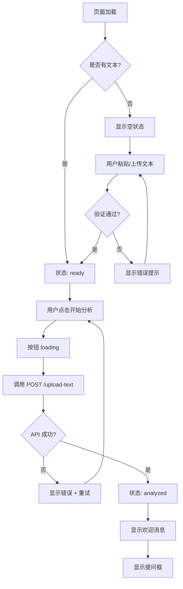
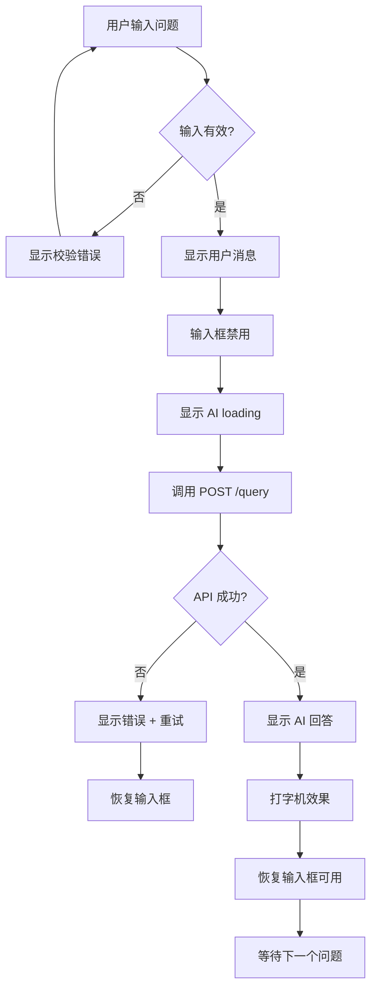

# 知识库问答系统 - 产品需求文档 (PRD)

> **文档版本**: v1.0.0  
> **创建日期**: 2026-04-22  
> **产品经理**: AI Assistant  
> **技术栈**: 前端（待选型）+ 后端（FastAPI）+ LLM（DeepSeek）+ Embedding（阿里云）

---

## 目录

- [1. 产品概述](#1-产品概述)
- [2. 产品目标](#2-产品目标)
- [3. 目标用户](#3-目标用户)
- [4. 技术架构](#4-技术架构)
- [5. 页面布局设计](#5-页面布局设计)
- [6. 核心功能需求](#6-核心功能需求)
- [7. 交互流程详解](#7-交互流程详解)
- [8. 状态机设计](#8-状态机设计)
- [9. UI/UX 规范](#9-uiux-规范)
- [10. API 接口契约](#10-api-接口契约)
- [11. 非功能性需求](#11-非功能性需求)
- [12. 验收标准](#12-验收标准)

---

## 1. 产品概述

### 1.1 产品名称

知识库问答工具（Knowledge Base QA Tool）

### 1.2 产品定位

极简、直观的知识库问答工具，用户只需上传或粘贴文本内容，即可通过自然对话方式获取文档中的信息。

### 1.3 核心价值主张

- **零学习成本**: 界面直观，无需培训即可使用
- **快速反馈**: 上传即分析，提问即回答
- **极简设计**: 去除一切冗余功能，专注核心体验

---

## 2. 产品目标

### 2.1 业务目标

| 目标 | 指标 | 优先级 |
|------|------|--------|
| 降低知识检索门槛 | 用户首次使用即可独立完成问答 | P0 |
| 提升信息获取效率 | 从提问到回答 < 5 秒 | P0 |
| 保持界面极简 | 首屏可见核心功能，无需滚动 | P1 |

### 2.2 用户体验目标

- **3 步完成问答**: 上传文本 → 点击分析 → 提问
- **即时反馈**: 每个操作都有明确的状态提示
- **容错设计**: 清晰的错误提示和恢复路径

---

## 3. 目标用户

### 3.1 用户画像

| 维度 | 描述 |
|------|------|
| **身份** | 学生、研究员、产品经理、技术人员 |
| **场景** | 阅读长文档后需要快速定位信息、学习新知识、提取关键内容 |
| **痛点** | 长文档阅读耗时长、信息检索效率低、难以快速理解核心内容 |
| **技术能力** | 具备基础互联网使用能力，无需编程技能 |

### 3.2 使用场景

**场景 1: 产品文档查询**
> 用户上传产品需求文档，通过提问"产品的核心功能是什么？"快速了解文档要点。

**场景 2: 学习笔记回顾**
> 学生上传课堂笔记，提问"第三章的重点是什么？"进行复习。

**场景 3: 技术文档检索**
> 开发者上传 API 文档，提问"如何配置身份认证？"获取操作步骤。

---

## 4. 技术架构

### 4.1 整体架构

```
┌─────────────────────────────────────────────────────┐
│                   前端（浏览器）                      │
│  ┌──────────────┐         ┌──────────────────────┐  │
│  │  左侧面板     │         │   右侧面板            │  │
│  │  文本上传区   │         │   对话窗口            │  │
│  │  - 粘贴/上传  │         │   - 气泡对话流        │  │
│  │  - 状态反馈   │         │   - 加载状态          │  │
│  └──────────────┘         └──────────────────────┘  │
└────────────────────────┬────────────────────────────┘
                         │ HTTP/REST API
┌────────────────────────▼────────────────────────────┐
│                   后端（FastAPI）                     │
│  ┌──────────────┐         ┌──────────────────────┐  │
│  │  文档服务     │         │   RAG 查询服务        │  │
│  │  - 文本解析   │         │   - Prompt 构建       │  │
│  │  - 内存存储   │         │   - LLM 调用          │  │
│  └──────────────┘         └──────────────────────┘  │
└────────┬──────────────────────────────┬─────────────┘
         │                              │
    ┌────▼────┐                  ┌──────▼──────┐
    │ DeepSeek │                  │  阿里云      │
    │   LLM    │                  │  Embedding  │
    └─────────┘                  └─────────────┘
```

### 4.2 技术栈选型

#### 后端（已完成）

| 组件 | 技术 | 说明 |
|------|------|------|
| Web 框架 | FastAPI 0.115.6 | 高性能异步 API |
| LLM | DeepSeek (兼容 OpenAI API) | 通过 OpenAI SDK 调用 |
| Embedding | 阿里云文本向量 API | 后续升级 RAG 时使用 |
| 配置管理 | Pydantic Settings | 环境变量管理 |

#### 前端（推荐）

| 组件 | 技术 | 说明 |
|------|------|------|
| 框架 | React 18 + Vite | 快速开发、热重载 |
| UI 库 | Ant Design 5.x | 企业级组件库 |
| HTTP 客户端 | Axios | API 调用 |
| 状态管理 | Zustand | 轻量级状态管理 |
| 样式方案 | Tailwind CSS | 原子化 CSS |

> **替代方案**: Vue 3 + Element Plus 或纯 HTML/CSS/JS（如需更轻量）

---

## 5. 页面布局设计

### 5.1 整体布局

```
┌──────────────────────────────────────────────────────────────┐
│  Header (固定顶部，高度 60px)                                  │
│  ┌──────────────────────────────────────────────────────────┐ │
│  │ 📚 知识库问答工具                           [🌙 深色模式]  │ │
│  └──────────────────────────────────────────────────────────┘ │
├────────────────────────┬─────────────────────────────────────┤
│                        │                                     │
│  左侧面板 (40%)        │   右侧面板 (60%)                     │
│                        │                                     │
│  ┌──────────────────┐  │  ┌───────────────────────────────┐ │
│  │ 📄 文本输入区     │  │  │ 💬 对话窗口                    │ │
│  │                  │  │  │                                │ │
│  │  ┌────────────┐  │  │  │  ┌────────────────────────┐  │ │
│  │  │ 在此粘贴   │  │  │  │  │ 🤖 AI: 你好！请先上传   │  │ │
│  │  │ 或上传文本 │  │  │  │  │    文档内容              │  │ │
│  │  └────────────┘  │  │  │  └────────────────────────┘  │ │
│  │                  │  │  │                                │ │
│  │  或              │  │  │  ┌────────────────────────┐  │ │
│  │                  │  │  │  │ 👤 你: 如何配置系统？    │  │ │
│  │  ┌────────────┐  │  │  │  └────────────────────────┘  │ │
│  │  │ 📎 上传文件 │  │  │  │                                │ │
│  │  └────────────┘  │  │  │  ┌────────────────────────┐  │ │
│  │                  │  │  │  │ 🤖 AI: 根据文档...       │  │ │
│  │  ──────────────  │  │  │  └────────────────────────┘  │ │
│  │                  │  │  │                                │ │
│  │  📊 状态指示器    │  │  │                                │ │
│  │  ⚪ 未上传文本    │  │  │                                │ │
│  │                  │  │  │                                │ │
│  │  ┌────────────┐  │  │  │                                │ │
│  │  │ 🚀 开始分析 │  │  │  │                                │ │
│  │  └────────────┘  │  │  │                                │ │
│  └──────────────────┘  │  └───────────────────────────────┘ │
│                        │  ┌───────────────────────────────┐ │
│                        │  │ 💭 提问框（分析后显示）         │ │
│                        │  │ ┌───────────────────────────┐ │ │
│                        │  │ │ 输入你的问题...      [发送]│ │ │
│                        │  │ └───────────────────────────┘ │ │
│                        │  └───────────────────────────────┘ │
└────────────────────────┴─────────────────────────────────────┘
```

### 5.2 响应式布局

| 屏幕宽度 | 布局策略 |
|---------|---------|
| ≥ 1200px | 左右分栏（40% / 60%） |
| 768px - 1199px | 左右分栏（50% / 50%） |
| < 768px | 上下堆叠，Tab 切换 |

---

## 6. 核心功能需求

### 6.1 功能模块清单

| 模块 | 功能 | 优先级 | 说明 |
|------|------|--------|------|
| M1 | 文本粘贴输入 | P0 | 支持 Ctrl+V 直接粘贴 |
| M2 | 文件上传 | P0 | 支持 .txt 文件拖拽或选择 |
| M3 | 状态反馈 | P0 | 实时显示文本上传状态 |
| M4 | 开始分析 | P0 | 触发后端文档处理 |
| M5 | 对话窗口 | P0 | 展示问答历史 |
| M6 | 提问交互 | P0 | 输入问题并获取回答 |
| M7 | 加载状态 | P0 | 显示 AI 处理进度 |
| M8 | 错误提示 | P0 | 友好的错误信息展示 |
| M9 | 清空对话 | P1 | 一键清空对话历史 |
| M10 | 重新上传 | P1 | 更换文档重新分析 |

---

### 6.2 模块详细需求

#### M1: 文本粘贴输入

**需求描述**:
- 提供一个多行文本输入框（Textarea）
- 支持用户直接粘贴文本内容
- 实时显示字符数统计

**UI 规范**:

```
┌──────────────────────────────────┐
│ 📄 粘贴文本内容                   │
│ ┌──────────────────────────────┐ │
│ │ 在此粘贴你的文档内容...       │ │
│ │                              │ │
│ │                              │ │
│ │                              │ │
│ └──────────────────────────────┘ │
│                          0/50000 │
└──────────────────────────────────┘
```

**交互规则**:

| 事件 | 行为 |
|------|------|
| 输入文本 | 实时更新字符计数 |
| 字符数 > 0 | "开始分析" 按钮变为可用状态 |
| 字符数 > 50000 | 显示警告："文本过长，建议控制在 5 万字以内" |
| 粘贴操作 | 自动去除多余空行，保留原始格式 |

**状态变量**:

```typescript
interface TextInputState {
  content: string;          // 文本内容
  charCount: number;        // 字符数
  isValid: boolean;         // 是否有效（1-50000字符）
  hasContent: boolean;      // 是否有内容
}
```

---

#### M2: 文件上传

**需求描述**:
- 支持点击选择和拖拽上传
- 仅支持 .txt 格式文件
- 自动读取文件内容并显示

**UI 规范**:

```
┌──────────────────────────────────┐
│ 📎 上传文本文件                   │
│ ┌──────────────────────────────┐ │
│ │                              │ │
│ │    📁                        │ │
│ │  点击或拖拽文件到此处         │ │
│ │  支持 .txt 格式              │ │
│ │                              │ │
│ └──────────────────────────────┘ │
└──────────────────────────────────┘
```

**交互规则**:

| 事件 | 行为 |
|------|------|
| 点击上传区域 | 弹出文件选择对话框 |
| 拖拽文件进入 | 高亮边框，显示"释放以上传" |
| 选择文件成功 | 读取内容，填充到文本输入框 |
| 文件格式错误 | 显示错误："仅支持 .txt 文件" |
| 文件过大（>10MB） | 显示错误："文件大小超出限制" |

**文件读取逻辑**:

```typescript
const handleFileUpload = (file: File) => {
  // 1. 验证文件类型
  if (!file.name.endsWith('.txt')) {
    showError('仅支持 .txt 格式文件');
    return;
  }
  
  // 2. 验证文件大小
  if (file.size > 10 * 1024 * 1024) {
    showError('文件大小不能超过 10MB');
    return;
  }
  
  // 3. 读取文件内容
  const reader = new FileReader();
  reader.onload = (e) => {
    const content = e.target?.result as string;
    setTextInput({ content, charCount: content.length });
    showSuccess('文件读取成功');
  };
  reader.readAsText(file, 'UTF-8');
};
```

---

#### M3: 状态反馈

**需求描述**:
- 清晰展示当前文档上传状态
- 状态变化时有视觉反馈

**状态定义**:

```typescript
type UploadStatus = 
  | 'empty'        // 未上传文本
  | 'inputting'    // 正在输入/粘贴
  | 'ready'        // 已输入，可分析
  | 'uploading'    // 正在提交到后端
  | 'uploaded'     // 上传成功，待分析
  | 'analyzing'    // 后端处理中
  | 'analyzed'     // 分析完成，可提问
  | 'error';       // 上传失败
```

**UI 展示**:

```
状态指示器样式：

⚪ 未上传文本           (empty)
🟡 已输入 1,234 字符    (ready)
🔵 正在提交...          (uploading)
🔵 正在分析...          (analyzing)
🟢 已就绪，可以提问      (analyzed)
🔴 上传失败：请重试      (error)
```

**状态变化规则**:

| 从状态 | 触发事件 | 到状态 | 视觉反馈 |
|--------|---------|--------|---------|
| empty | 用户输入文本 | inputting | 状态文字变黄 |
| inputting | 输入完成（停顿 1s） | ready | 状态文字变绿，按钮可用 |
| ready | 点击"开始分析" | uploading | 显示加载动画 |
| uploading | 后端响应成功 | analyzing | 进度条或旋转图标 |
| analyzing | 分析完成 | analyzed | 状态变绿，提问框出现 |
| 任意状态 | 请求失败 | error | 红色错误提示 + 重试按钮 |

---

#### M4: 开始分析

**需求描述**:
- 用户确认文本内容后，点击按钮触发后端处理
- 按钮在文本为空时禁用

**UI 规范**:

```
未输入状态（禁用）:
┌────────────────────────┐
│ 🚀 开始分析 (disabled) │
└────────────────────────┘

已输入状态（可用）:
┌────────────────────────┐
│ 🚀 开始分析             │
└────────────────────────┘

分析中状态（加载中）:
┌────────────────────────┐
│ ⏳ 分析中...            │
└────────────────────────┘
```

**按钮状态逻辑**:

```typescript
interface AnalyzeButtonState {
  isEnabled: boolean;      // 是否可点击
  isLoading: boolean;      // 是否显示加载状态
  text: string;            // 按钮文字
}

// 状态计算
const getButtonState = (uploadStatus: UploadStatus): AnalyzeButtonState => {
  switch (uploadStatus) {
    case 'ready':
      return { isEnabled: true, isLoading: false, text: '🚀 开始分析' };
    case 'uploading':
    case 'analyzing':
      return { isEnabled: false, isLoading: true, text: '⏳ 分析中...' };
    case 'analyzed':
      return { isEnabled: false, isLoading: false, text: '✅ 分析完成' };
    default:
      return { isEnabled: false, isLoading: false, text: '🚀 开始分析' };
  }
};
```

**点击后交互流程**:

```
用户点击"开始分析"
    ↓
按钮变为 loading 状态（禁用 + 旋转图标）
    ↓
调用后端 API: POST /api/v1/upload-text
    ├─ 成功 → 状态变为 "analyzed"
    │         ↓
    │      右侧显示欢迎消息
    │         ↓
    │      底部出现提问框
    │
    └─ 失败 → 状态变为 "error"
              ↓
           显示错误提示 + "重试"按钮
```

---

#### M5: 对话窗口

**需求描述**:
- 以气泡对话流形式展示问答历史
- 区分用户消息和 AI 回复
- 自动滚动到最新消息

**UI 规范**:

```
┌─────────────────────────────────────┐
│ 💬 对话窗口                          │
│ ┌─────────────────────────────────┐ │
│ │                                 │ │
│ │  ┌──────────────────────────┐  │ │
│ │  │ 🤖 AI                    │  │ │
│ │  │ 文档已分析完成！          │  │ │
│ │  │ 你可以开始提问了。        │  │ │
│ │  └──────────────────────────┘  │ │
│ │                                 │ │
│ │              ┌────────────────┐ │ │
│ │              │ 你             │ │ │
│ │              │ 核心功能是什么？│ │ │
│ │              └────────────────┘ │ │
│ │                                 │ │
│ │  ┌──────────────────────────┐  │ │
│ │  │ 🤖 AI                    │  │ │
│ │  │ 根据文档内容，核心功能    │  │ │
│ │  │ 包括：                   │  │ │
│ │  │ 1. 用户管理              │  │ │
│ │  │ 2. 数据分析              │  │ │
│ │  └──────────────────────────┘  │ │
│ │                                 │ │
│ └─────────────────────────────────┘ │
└─────────────────────────────────────┘
```

**气泡样式规范**:

| 元素 | AI 消息 | 用户消息 |
|------|---------|---------|
| 对齐方式 | 左对齐 | 右对齐 |
| 背景色 | `#F0F2F5` (浅灰) | `#1890FF` (蓝色) |
| 文字色 | `#262626` (深灰) | `#FFFFFF` (白色) |
| 头像 | 🤖 图标（左侧） | 👤 图标（右侧） |
| 气泡圆角 | 左上直角，其余圆角 | 右上直角，其余圆角 |
| 最大宽度 | 70% 容器宽度 | 70% 容器宽度 |

**数据结构**:

```typescript
interface Message {
  id: string;              // 唯一标识
  role: 'user' | 'assistant';  // 角色
  content: string;         // 消息内容
  timestamp: Date;         // 时间戳
  status: 'sending' | 'sent' | 'error';  // 发送状态
  metadata?: {
    queryId?: string;      // 查询 ID
    processingTime?: number;  // 处理时间
    contextLength?: number;   // 上下文长度
  };
}
```

---

#### M6: 提问交互

**需求描述**:
- 分析完成后，底部出现提问框
- 用户输入问题后点击发送或按 Enter
- 显示在对话窗口中

**UI 规范**:

```
未分析状态（隐藏）:
[提问框不显示]

分析完成状态（显示）:
┌─────────────────────────────────────┐
│ 💭 提问你的问题                      │
│ ┌─────────────────────────────────┐ │
│ │ 输入你的问题...           [发送 ▶]│ │
│ └─────────────────────────────────┘ │
└─────────────────────────────────────┘
```

**输入框规范**:

```typescript
interface QuestionInputState {
  value: string;           // 当前输入值
  isLoading: boolean;      // 是否正在发送
  maxLength: number;       // 最大长度 2000
  canSend: boolean;        // 是否可以发送
}

// 计算属性
const canSend = computed(() => {
  return value.trim().length > 0 && 
         value.trim().length <= 2000 && 
         !isLoading;
});
```

**交互规则**:

| 事件 | 行为 |
|------|------|
| 输入文本 | 实时更新输入值 |
| 按 Enter | 发送问题（Shift+Enter 换行） |
| 点击发送按钮 | 发送问题 |
| 字符数 > 2000 | 输入框边框变红，显示"问题过长" |
| 发送中 | 按钮变为 loading 状态，禁用输入 |

**发送流程**:

```
用户输入问题并点击发送
    ↓
1. 验证输入（非空 + 长度 ≤ 2000）
    ↓
2. 在对话窗口中立即显示用户消息（乐观更新）
    ↓
3. 输入框清空并禁用
    ↓
4. 显示 AI "正在输入" 动画
    ↓
5. 调用后端 API: POST /api/v1/query
    ├─ 成功 → 显示 AI 回答
    │         ↓
    │      恢复输入框可用
    │
    └─ 失败 → 显示错误提示
              ↓
           保留用户消息，允许重试
```

---

#### M7: 加载状态

**需求描述**:
- 所有异步操作都有明确的加载反馈
- 防止用户重复操作

**加载状态清单**:

| 场景 | 加载表现形式 | 持续时间 |
|------|------------|---------|
| 文档上传中 | 按钮 loading + "提交中..." | 1-3 秒 |
| 文档分析中 | 进度条或旋转图标 + "AI 正在分析文档..." | 2-5 秒 |
| 问题发送中 | 消息气泡显示 "..." 动画 | 1-10 秒 |
| AI 回答生成中 | 打字机效果（逐字显示） | 2-8 秒 |

**打字机效果实现**:

```typescript
// AI 回答逐字显示
const TypewriterEffect = ({ text, speed = 30 }) => {
  const [displayedText, setDisplayedText] = useState('');
  
  useEffect(() => {
    let index = 0;
    const timer = setInterval(() => {
      if (index < text.length) {
        setDisplayedText(text.slice(0, index + 1));
        index++;
      } else {
        clearInterval(timer);
      }
    }, speed);
    
    return () => clearInterval(timer);
  }, [text, speed]);
  
  return <div>{displayedText}</div>;
};
```

**加载遮罩规范**:

```
┌─────────────────────────┐
│                         │
│    ⏳                   │
│  分析中，请稍候...       │
│                         │
│  ▓▓▓▓▓▓▓▓░░░░  65%     │
│                         │
└─────────────────────────┘
```

---

#### M8: 错误提示

**需求描述**:
- 所有错误都有友好提示
- 提供明确的恢复路径

**错误提示类型**:

| 错误类型 | 提示方式 | 展示位置 | 持续时间 |
|---------|---------|---------|---------|
| 参数校验失败 | Toast 提示 | 页面顶部 | 3 秒 |
| 网络请求失败 | Alert + 重试按钮 | 对应操作区域 | 手动关闭 |
| 后端业务错误 | Toast + 错误码 | 页面顶部 | 5 秒 |
| 系统异常 | Modal 弹窗 | 页面中央 | 手动关闭 |

**错误提示 UI**:

```
Toast 成功提示:
┌──────────────────────────────┐
│ ✅ 文档上传成功               │
└──────────────────────────────┘

Toast 错误提示:
┌──────────────────────────────┐
│ ❌ 上传失败：文本内容为空     │
│    [重试]                    │
└──────────────────────────────┘

内联错误提示（输入框下方）:
┌──────────────────────────────┐
│ 输入你的问题...               │
└──────────────────────────────┘
⚠️ 问题不能为空
```

**错误码映射表**:

```typescript
const ERROR_MESSAGES: Record<number, string> = {
  1001: '不支持的文件类型，仅支持 .txt 格式',
  1002: '文件大小超出限制（最大 10MB）',
  1003: '文本内容不能为空',
  2001: '问题不能为空',
  2002: '问题长度超出限制（最多 2000 字符）',
  2005: '知识库为空，请先上传文档',
  2006: '查询处理失败，请重试',
  2007: 'AI 服务暂时不可用，请稍后重试',
  9999: '服务器内部错误，请联系管理员',
};

const getErrorMessage = (code: number, fallback: string): string => {
  return ERROR_MESSAGES[code] || fallback;
};
```

---

#### M9: 清空对话

**需求描述**:
- 提供一键清空对话历史功能
- 清空前有二次确认

**UI 位置**: 对话窗口右上角

**交互流程**:

```
用户点击"清空对话"图标
    ↓
弹出确认对话框：
┌──────────────────────────────┐
│ ⚠️ 确认清空对话               │
│                              │
│ 此操作将删除所有对话记录，    │
│ 是否继续？                    │
│                              │
│    [取消]      [确认清空]     │
└──────────────────────────────┘
    ↓
用户确认 → 清空对话数组
    ↓
显示 AI 欢迎消息："对话已清空，你可以继续提问。"
```

---

#### M10: 重新上传

**需求描述**:
- 允许用户更换文档重新分析
- 重新上传前清空对话历史

**UI 位置**: 左侧面板顶部

**交互流程**:

```
用户点击"重新上传"按钮
    ↓
弹出确认对话框：
┌──────────────────────────────┐
│ 🔄 重新上传文档               │
│                              │
│ 上传新文档将清空当前对话，    │
│ 是否继续？                    │
│                              │
│    [取消]      [继续]         │
└──────────────────────────────┘
    ↓
用户确认 → 清空对话 + 重置状态
    ↓
清空文本输入框
    ↓
状态变为 "empty"
    ↓
隐藏提问框
```

---

## 7. 交互流程详解

### 7.1 完整用户旅程

```
用户首次访问
    ↓
【页面加载】
├─ 显示空状态（左侧：输入区，右侧：欢迎提示）
└─ 状态：empty
    ↓
【步骤 1: 输入文本】
├─ 用户粘贴文本或上传文件
├─ 实时显示字符数
└─ 状态：inputting → ready
    ↓
【步骤 2: 开始分析】
├─ 用户点击"开始分析"按钮
├─ 按钮变为 loading
├─ 调用后端 API
│   ├─ 成功 → 状态：analyzed
│   └─ 失败 → 显示错误，状态：error
└─ 成功时：
    ├─ 右侧显示："文档已分析完成！"
    ├─ 底部出现提问框
    └─ 状态：analyzed
    ↓
【步骤 3: 提问】
├─ 用户输入问题
├─ 点击发送或按 Enter
├─ 调用后端 API
│   ├─ 成功 → 显示 AI 回答（打字机效果）
│   └─ 失败 → 显示错误提示
└─ 循环：用户可继续提问
    ↓
【步骤 4: 结束或重新上传】
├─ 用户可清空对话继续提问
└─ 或点击"重新上传"更换文档
```

### 7.2 核心交互流程图

#### 流程图 1: 文档上传与分析



#### 流程图 2: 知识查询



---

## 8. 状态机设计

### 8.1 全局状态定义

```typescript
interface AppState {
  // 左侧面板状态
  textInput: {
    content: string;
    charCount: number;
    status: UploadStatus;
  };
  
  // 右侧面板状态
  chat: {
    messages: Message[];
    isInputVisible: boolean;  // 提问框是否显示
    isAnalyzing: boolean;     // AI 是否正在生成回答
  };
  
  // 全局状态
  ui: {
    isLoading: boolean;       // 全局加载状态
    error: Error | null;      // 当前错误
    theme: 'light' | 'dark';  // 主题
  };
}
```

### 8.2 状态转换矩阵

| 当前状态 | 用户操作 | 新状态 | 副作用 |
|---------|---------|--------|--------|
| empty | 输入文本 | inputting | 启用"开始分析"按钮 |
| inputting | 输入完成 | ready | 显示字符数 |
| ready | 点击分析 | uploading | 调用 API |
| uploading | API 成功 | analyzing | 显示进度 |
| analyzing | 分析完成 | analyzed | 显示提问框 |
| analyzed | 输入问题 | questioning | 调用 API |
| questioning | 获取回答 | answered | 显示消息 |
| 任意状态 | API 失败 | error | 显示错误 |
| error | 点击重试 | 原状态 | 重新调用 API |

---

## 9. UI/UX 规范

### 9.1 设计系统

#### 色彩规范

| 用途 | 颜色 | Hex | 使用场景 |
|------|------|-----|---------|
| 主色 | 🔵 蓝色 | `#1890FF` | 按钮、链接、用户气泡 |
| 成功 | 🟢 绿色 | `#52C41A` | 成功状态、完成提示 |
| 警告 | 🟡 黄色 | `#FAAD14` | 警告状态、输入中 |
| 错误 | 🔴 红色 | `#FF4D4F` | 错误提示、失败状态 |
| 信息 | 🔵 浅蓝 | `#E6F7FF` | AI 气泡背景 |
| 文字 - 主 | ⚫ 深灰 | `#262626` | 正文内容 |
| 文字 - 次 | ⚫ 中灰 | `#595959` | 辅助说明 |
| 文字 - 提示 | ⚫ 浅灰 | `#8C8C8C` | 占位符、禁用状态 |
| 背景 - 主 | ⚪ 白色 | `#FFFFFF` | 页面背景 |
| 背景 - 次 | ⚪ 浅灰 | `#F5F5F5` | 卡片背景 |
| 边框 | ⚪ 中灰 | `#D9D9D9` | 输入框、分割线 |

#### 字体规范

| 元素 | 字体 | 大小 | 字重 |
|------|------|------|------|
| 页面标题 | - | 20px | 600 |
| 模块标题 | - | 16px | 600 |
| 正文内容 | - | 14px | 400 |
| 辅助说明 | - | 12px | 400 |
| 按钮文字 | - | 14px | 500 |
| 代码/等宽 | monospace | 13px | 400 |

#### 间距规范

```
基础单位: 8px

间距等级:
- xs: 4px
- sm: 8px
- md: 16px
- lg: 24px
- xl: 32px
- xxl: 48px
```

#### 圆角规范

| 元素 | 圆角 |
|------|------|
| 按钮 | 4px |
| 输入框 | 4px |
| 卡片 | 8px |
| 气泡（直角侧） | 2px |
| 气泡（圆角侧） | 12px |
| Modal | 8px |

---

### 9.2 组件规范

#### 按钮规范

```css
/* 主按钮 */
.btn-primary {
  background: #1890FF;
  color: #FFFFFF;
  padding: 8px 16px;
  border-radius: 4px;
  font-size: 14px;
  cursor: pointer;
  transition: all 0.3s;
}

.btn-primary:hover {
  background: #40A9FF;
}

.btn-primary:disabled {
  background: #D9D9D9;
  cursor: not-allowed;
}

/* 加载状态 */
.btn-primary.loading {
  pointer-events: none;
  opacity: 0.7;
}
```

#### 输入框规范

```css
.input-field {
  border: 1px solid #D9D9D9;
  border-radius: 4px;
  padding: 8px 12px;
  font-size: 14px;
  transition: border-color 0.3s;
}

.input-field:focus {
  border-color: #1890FF;
  outline: none;
  box-shadow: 0 0 0 2px rgba(24, 144, 255, 0.2);
}

.input-field.error {
  border-color: #FF4D4F;
}

.input-field:disabled {
  background: #F5F5F5;
  cursor: not-allowed;
}
```

---

### 9.3 动效规范

| 场景 | 动效 | 持续时间 | 缓动函数 |
|------|------|---------|---------|
| 按钮悬停 | 颜色渐变 | 0.3s | ease-in-out |
| 消息出现 | 淡入 + 上移 | 0.3s | ease-out |
| 加载旋转 | 360° 旋转 | 1s | linear |
| 错误提示 | 抖动 + 淡入 | 0.4s | ease-out |
| 打字机效果 | 逐字显示 | 30ms/字 | linear |

---

## 10. API 接口契约

### 10.1 基础信息

```
Base URL: http://localhost:8000
Content-Type: application/json (查询接口)
              multipart/form-data (上传接口)
```

### 10.2 接口清单

| 接口 | 方法 | 路径 | 用途 |
|------|------|------|------|
| 健康检查 | GET | `/api/v1/health` | 检查服务状态 |
| 上传文件 | POST | `/api/v1/upload` | 上传 .txt 文件 |
| 上传文本 | POST | `/api/v1/upload-text` | 提交文本内容 |
| 知识查询 | POST | `/api/v1/query` | 基于文档提问 |

### 10.3 接口详细定义

#### 接口 1: 上传文本

```typescript
// 请求
POST /api/v1/upload-text
Content-Type: application/x-www-form-urlencoded

Body:
{
  text: string  // 文本内容，1-50000 字符
}

// 成功响应 (200)
{
  code: 0,
  message: "success",
  data: {
    documentId: string,      // "doc_a1b2c3d4e5f6"
    fileName: string,        // "direct_text_input.txt"
    fileSize: number,        // 字节数
    contentPreview: string,  // 前 200 字符
    processingTime: number,  // 秒
    uploadedAt: string       // ISO 8601 时间
  }
}

// 错误响应 (400)
{
  code: 1003,
  message: "文本内容不能为空",
  data: null
}
```

#### 接口 2: 知识查询

```typescript
// 请求
POST /api/v1/query
Content-Type: application/json

Body:
{
  question: string  // 用户问题，1-2000 字符
}

// 成功响应 (200)
{
  code: 0,
  message: "success",
  data: {
    queryId: string,        // "qry_x9y8z7w6v5u4"
    answer: string,         // AI 回答
    contextLength: number,  // 上下文长度
    processingTime: number, // 秒
    timestamp: string       // ISO 8601 时间
  }
}

// 错误响应 (404)
{
  code: 2005,
  message: "知识库为空，请先上传文档",
  data: null
}
```

### 10.4 前端调用示例

```typescript
import axios from 'axios';

const API_BASE = 'http://localhost:8000';

// 上传文本
export const uploadText = async (text: string) => {
  try {
    const formData = new URLSearchParams();
    formData.append('text', text);
    
    const response = await axios.post(
      `${API_BASE}/api/v1/upload-text`,
      formData,
      { headers: { 'Content-Type': 'application/x-www-form-urlencoded' } }
    );
    
    return response.data;
  } catch (error) {
    if (axios.isAxiosError(error) && error.response) {
      throw new Error(error.response.data.message);
    }
    throw new Error('网络请求失败');
  }
};

// 知识查询
export const queryKnowledge = async (question: string) => {
  try {
    const response = await axios.post(
      `${API_BASE}/api/v1/query`,
      { question },
      { headers: { 'Content-Type': 'application/json' } }
    );
    
    return response.data;
  } catch (error) {
    if (axios.isAxiosError(error) && error.response) {
      throw new Error(error.response.data.message);
    }
    throw new Error('网络请求失败');
  }
};
```

---

## 11. 非功能性需求

### 11.1 性能需求

| 指标 | 目标值 | 测量方式 |
|------|--------|---------|
| 首屏加载时间 | < 2 秒 | Lighthouse |
| API 响应时间（上传） | < 3 秒 | 网络监控 |
| API 响应时间（查询） | < 10 秒 | 网络监控 |
| 页面流畅度 | 60 FPS | Performance API |
| 内存占用 | < 100MB | Chrome DevTools |

### 11.2 兼容性需求

| 维度 | 要求 |
|------|------|
| 浏览器 | Chrome 90+, Firefox 88+, Safari 14+, Edge 90+ |
| 移动端 | iOS Safari 14+, Android Chrome 90+ |
| 屏幕分辨率 | ≥ 1280x720（最佳），≥ 768x1024（可用） |

### 11.3 安全性需求

| 风险 | 防护措施 |
|------|---------|
| XSS 攻击 | 输入内容转义输出，使用 React 自动转义 |
| CSRF 攻击 | 后端已配置 CORS，前端无需额外处理 |
| 敏感信息泄露 | API Key 不暴露在前端代码中 |
| 大文件上传 | 前端限制 10MB，后端限制 10MB |

### 11.4 可用性需求

| 场景 | 要求 |
|------|------|
| 网络断开 | 显示"网络连接失败"提示，提供重试按钮 |
| 服务不可用 | 显示"服务暂时不可用"提示，5 秒后自动重试 |
| 接口超时 | 超时时间 30 秒，超时后显示错误提示 |

---

## 12. 验收标准

### 12.1 功能验收

| 编号 | 功能 | 验收标准 | 优先级 |
|------|------|---------|--------|
| F1 | 文本粘贴 | 用户可粘贴文本，实时显示字符数 | P0 |
| F2 | 文件上传 | 支持 .txt 文件选择和拖拽上传 | P0 |
| F3 | 状态反馈 | 所有状态变化都有视觉反馈 | P0 |
| F4 | 开始分析 | 按钮在文本为空时禁用，点击后调用 API | P0 |
| F5 | 对话展示 | 正确显示用户消息和 AI 回复 | P0 |
| F6 | 提问交互 | 可输入问题并获取 AI 回答 | P0 |
| F7 | 加载状态 | 所有异步操作都有加载反馈 | P0 |
| F8 | 错误处理 | 错误提示友好且提供恢复路径 | P0 |
| F9 | 清空对话 | 二次确认后清空对话历史 | P1 |
| F10 | 重新上传 | 二次确认后重置所有状态 | P1 |

### 12.2 性能验收

| 编号 | 指标 | 目标值 | 测试方法 |
|------|------|--------|---------|
| P1 | 首屏加载 | < 2 秒 | Lighthouse |
| P2 | 上传响应 | < 3 秒 | 网络面板 |
| P3 | 查询响应 | < 10 秒 | 网络面板 |
| P4 | 页面流畅度 | 无卡顿 | 手动测试 |

### 12.3 兼容性验收

| 编号 | 平台 | 验收标准 |
|------|------|---------|
| C1 | Chrome 90+ | 所有功能正常 |
| C2 | Firefox 88+ | 所有功能正常 |
| C3 | Safari 14+ | 所有功能正常 |
| C4 | 移动端 | 布局自适应，核心功能可用 |

---

## 附录 A: 术语表

| 术语 | 定义 |
|------|------|
| RAG | Retrieval-Augmented Generation，检索增强生成 |
| LLM | Large Language Model，大语言模型 |
| Embedding | 文本向量化表示 |
| DeepSeek | 本次使用的 LLM 提供商 |
| 阿里云 Embedding | 本次使用的文本向量化服务 |
| MVP | Minimum Viable Product，最小可行产品 |

---

## 附录 B: 变更记录

| 版本 | 日期 | 变更内容 | 变更人 |
|------|------|---------|--------|
| v1.0.0 | 2026-04-22 | 初始版本 | AI Assistant |

---

## 附录 C: 技术栈配置说明

### C.1 DeepSeek LLM 配置

```env
# .env 文件（后端）
OPENAI_API_KEY=your-deepseek-api-key
OPENAI_MODEL=deepseek-chat
OPENAI_BASE_URL=https://api.deepseek.com/v1
```

**说明**: DeepSeek API 兼容 OpenAI SDK，只需修改 base_url 和 model 参数即可。

### C.2 阿里云 Embedding 配置

```env
# .env 文件（后端，后续升级 RAG 时使用）
DASHSCOPE_API_KEY=your-dashscope-api-key
EMBEDDING_MODEL=text-embedding-v3
EMBEDDING_BASE_URL=https://dashscope.aliyuncs.com/api/v1
```

**说明**: 阿里云 DashScope 提供 OpenAI 兼容接口，可通过 langchain-community 集成。

---

**文档结束**

> 如有疑问或需要补充，请联系产品团队。
